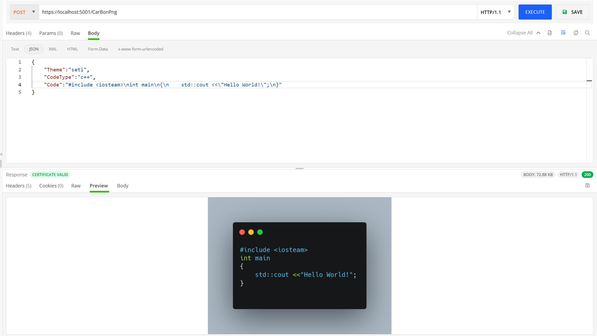

# Carbon-Webapi
A Webapi that make you can easily get Carbon image.

# How To Use

1. Download portal Firefox and get the path.
2. Edit `Appsettings.json` and put the path of Firefox and the max retries.

# Config

```json
{
  "Logging": {
    "LogLevel": {
      "Default": "Information",
      "Microsoft.AspNetCore": "Warning"
    }
  },
  "AllowedHosts": "*",
  "firefoxPath": "",
  "MaxRetry": "15"
}
```

firefoxPath: The path of the portal firefox

MaxRetry: The max times to try to download the picture. Each try will wait for 100 ms.

# Api

```
[post]
EndPoint:/CarbonPng
JsonBody:
{
    "Theme":"seti",
    "CodeType":"c++",
    "Size":"2x",
    "Code":"#include <iostream>\nint main()\n{\n}"
}
```

Parameter:

- Theme: The style of the code color
- CodeType: The type of the code, just use the same as the website.
- Code: The code of what you want to use to generate the picture.
- Size: Optional for 1x,2x,4x

# Demo


